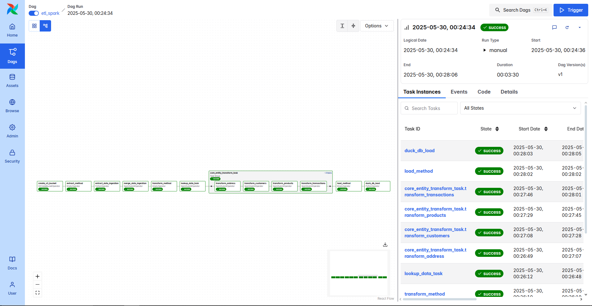

# End-to-End-ETL-PySpark



An end-to-end ETL pipeline implemented using **Apache Airflow 3.0.1**, **Apache Spark**, **MinIO**, and **Docker**, designed to ingest, transform, and load retail data into a DuckDB-based analytical environment.

---

## 🔧 Tech Stack

- **Apache Airflow 3.0.1** (CeleryExecutor)
- **Apache Spark** (PySpark in-client mode)
- **MinIO** (S3-compatible object storage)
- **DuckDB** (analytical in-process database)
- **PostgreSQL** (Airflow metadata DB)
- **Redis** (Celery broker)
- **Docker & Docker Compose**

---

## 📁 Project Structure

```
├── dags/
│   └── ETL_dags.py               # Main DAG script
├── functions/
│   └── retail/
│       ├── extract/
│       │   ├── load_data.py
│       │   └── merge_data_extraction.py
│       ├── load/
│       │   └── duck_db.py
│       └── transform/
│           ├── lookup_data/transform_lookup_data.py
│           └── core_entity_data/
│               ├── transform_address_core.py
│               ├── transform_customers_core.py
│               ├── transform_products_core.py
│               └── transform_transactions_core.py
├── .env                          # Environment variables (MinIO creds)
├── docker-compose.yml            # Full stack config
├── Dockerfile.airflow            # Airflow image build
└── scripts/setup_conn.py         # Airflow connection setup
```

---

## ⚙️ Airflow DAG Overview

**DAG ID:** `etl_spark`

**Description:** Executes an ETL flow in the following order:

1. **Create S3 bucket (MinIO)**
2. **Extract Phase**

   - Empty init task
   - Python ingestion using `data_ingestion()`
   - Spark-based merge transformation

3. **Transform Phase**

   - Lookup enrichment via PySpark
   - Core Entity transformations:

     - Address
     - Customers
     - Products
     - Transactions (chained sequence)

4. **Load Phase**

   - Python task to write into DuckDB

---

## 🚀 Running the Project

### 1. Clone and Prepare

```bash
git clone <your-repo-url>
cd <your-repo>
cp .env.example .env  # or create your .env file with MinIO creds
```

### 2. Start Docker Services

```bash
docker compose up --build
```

Ensure you allocate at least:

- 4 GB RAM
- 2 CPUs
- 10 GB disk space

### 3. Access Airflow UI

- URL: `http://localhost:8080`
- Default login: `airflow / airflow`

### 4. Trigger the DAG

1. Enable the `etl_spark` DAG.
2. Trigger manually from the UI.

---

## 🔑 Environment Variables (`.env`)

```env
MINIO_ACCESS_KEY=minioLocalAccessKey
MINIO_SECRET_KEY=minioLocalSecretKey123
```

---

## 📦 Docker Services Overview

| Service    | Port(s) | Description                        |
| ---------- | ------- | ---------------------------------- |
| Airflow UI | 8080    | DAG monitoring and management      |
| PostgreSQL | 5432    | Metadata DB for Airflow            |
| Redis      | 6379    | Celery backend                     |
| MinIO (S3) | 9000    | S3-compatible file storage backend |
| Jupyter    | 8888    | Notebook with pyspark build        |

---

## 🧠 ETL Flow Logic Summary

```mermaid
graph TD
    A[Create S3 Bucket] --> B[Extract Init]
    B --> C[Python: data_ingestion()]
    C --> D[Spark: merge_data_extraction.py]
    D --> E[Transform Init]
    E --> F[Spark: transform_lookup_data.py]
    F --> G1[Spark: transform_address_core.py]
    G1 --> G2[Spark: transform_customers_core.py]
    G2 --> G3[Spark: transform_products_core.py]
    G3 --> G4[Spark: transform_transactions_core.py]
    G4 --> H[Load Init]
    H --> I[Python: execute_duckdb_etl()]
```

---

## 📌 Notes

- Spark uses MinIO as the S3 endpoint via `s3a://`.
- Spark jobs run in client mode inside the Airflow worker container.
- Data is stored on MinIO and loaded into DuckDB.
- All SparkSubmit tasks are configured via `conf=s3_config` with Spark-Hadoop S3A integration.

---

## 📜 License

MIT License

---

## 👤 Author

**Ikigami** [GitHub](https://github.com/ikigamisama)

---

Feel free to fork, contribute, or raise issues!
